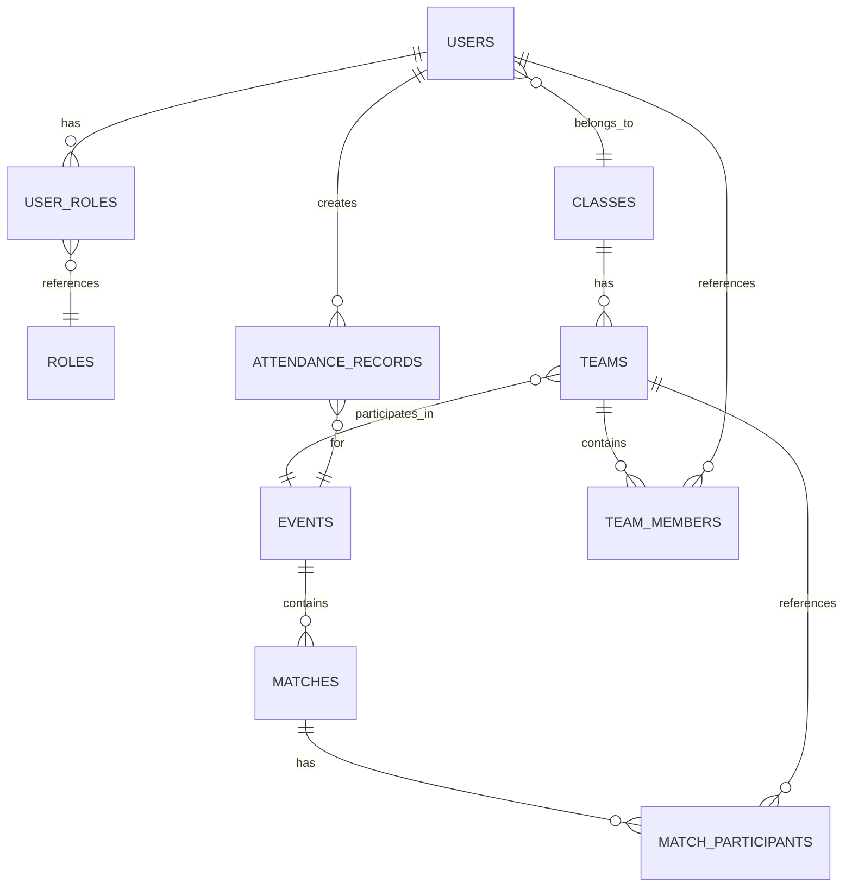

# スポーツ大会の運営を楽にするwebアプリケーションを作成したい

このwebアプリは二つに分かれる
- Adminアプリケーション
- Studentアプリケーション

基本的な構成としては、Adminアプリケーションで情報を登録し、Studentアプリで各学生が情報を確認する。
ユーザー認証はグーグルアカウント認証で行う。`@sendai-nct.jp`のアカウントのみ認可する。
フロントはSvelte,バックはGo(gin)を使う予定
dockerで動かす

## コンポーネントとインターフェース

### 1. SportEase-API（バックエンド）

**技術スタック:**
- Go 1.21+ with Gin framework
- GORM for database ORM
- JWT for session management
- Google API Client for Go for authentication

**コアモジュール:**

#### 認証モジュール
- ドメイン制限付きGoogle OAuth 2.0統合
- JWTトークン生成と検証
- 役割ベースアクセス制御ミドルウェア
- Redisによるセッション管理

#### ユーザー管理モジュール
- 役割割り当て付きユーザーCRUD操作
- CSV一括インポート機能
- ユーザー役割に基づく権限検証
- すべてのユーザー操作の監査ログ

#### イベント管理モジュール
- 競技作成と管理
- チーム登録と検証
- トーナメント表生成（ランダムシード）
- 試合スケジュールと結果追跡

#### QRコードモジュール
- 時間ベース検証付き動的QRコード生成
- 参加ログ付きQRコード確認
- 出席記録管理
- 不正防止検証（時間窓、ユーザー適格性）

#### 通知モジュール
- お知らせ作成と配信
- 試合結果のリアルタイム通知
- クラス固有およびグローバルメッセージング
- 重要な更新のメール統合

### 2. SportEase-Admin（管理者フロントエンド）

**技術スタック:**
- Next.js 14 with App Router
- TypeScript for type safety
- Tailwind CSS for styling
- SvelteKit for server-side rendering
- Chart.js for dashboard visualizations

**主要機能:**

#### ダッシュボード
- リアルタイム競技進行概要
- アクティブな試合と今後のイベント
- システムヘルスとユーザーアクティビティメトリクス
- 一般的なタスクのクイックアクションボタン

#### ユーザー管理インターフェース
- 役割割り当て付きユーザー作成/編集フォーム
- 検証フィードバック付きCSVアップロードインターフェース
- 役割管理用権限マトリックス
- ユーザーアクティビティとログイン履歴ビュー

#### 競技管理インターフェース
- 検証付き競技作成ウィザード
- ドラッグアンドドロップ付きトーナメント表エディター
- スコア検証付き試合結果入力フォーム
- トーナメント表のPDFエクスポート機能

#### QRコード確認インターフェース
- デバイスカメラを使用したQRコードスキャナー統合
- リアルタイム検証フィードバック
- 参加履歴と分析
- 大規模イベント用一括確認

### 3. SportEase-Student（学生フロントエンド）

**技術スタック:**
- Next.js 14 with App Router
- TypeScript for type safety
- Tailwind CSS for styling
- PWA capabilities for mobile experience
- QR code generation library

**主要機能:**

#### 個人ダッシュボード
- クラスとチーム情報付きユーザープロフィール
- 今後の競技とスケジュール
- 個人参加履歴
- 未読インジケーター付き通知センター

#### 競技ビューアー
- 競技詳細とルール
- リアルタイムトーナメント表
- 試合結果と順位
- チームメンバー情報

#### QRコードジェネレーター
- 時間制限付きQRコード生成
- 検証付き競技固有コード
- コード状態の視覚的フィードバック
- 生成されたコードのオフライン機能

## データモデル

### コアエンティティ

#### ユーザーモデル
```go
type User struct {
    ID            uint      `gorm:"primaryKey"`
    GoogleOID     string    `gorm:"uniqueIndex;not null"`
    Email         string    `gorm:"uniqueIndex;not null"`
    DisplayName   string    `gorm:"not null"`
    ClassID       *uint     `gorm:"index"`
    IsInitialLogin bool     `gorm:"default:true"`
    Class         Class     `gorm:"foreignKey:ClassID"`
    Roles         []Role    `gorm:"many2many:user_roles"`
    CreatedAt     time.Time
    UpdatedAt     time.Time
}
```

#### イベントモデル
```go
type Event struct {
    ID                      uint      `gorm:"primaryKey"`
    Name                    string    `gorm:"not null"`
    Description             string    `gorm:"type:text"`
    Location                string
    StartAt                 *time.Time
    MinParticipantsPerClass *uint
    MaxParticipantsPerClass *uint
    IsExperienceRestricted  bool      `gorm:"default:false"`
    Teams                   []Team    `gorm:"foreignKey:EventID"`
    Matches                 []Match   `gorm:"foreignKey:EventID"`
    CreatedAt               time.Time
    UpdatedAt               time.Time
}
```

#### QRコードデータ構造
```go
type QRCodeData struct {
    UserID      uint      `json:"user_id"`
    EventID     uint      `json:"event_id"`
    GeneratedAt time.Time `json:"generated_at"`
    ExpiresAt   time.Time `json:"expires_at"`
    Signature   string    `json:"signature"`
}
```

### データベース関係



## エラーハンドリング

### APIエラーレスポンス形式
```json
{
  "error": {
    "code": "VALIDATION_ERROR",
    "message": "Invalid input data",
    "details": {
      "field": "email",
      "reason": "Domain not allowed"
    },
    "timestamp": "2024-01-15T10:30:00Z"
  }
}
```

### エラーカテゴリ
1. **認証エラー**: 無効なトークン、ドメイン制限
2. **認可エラー**: 権限不足、役割違反
3. **検証エラー**: 無効な入力データ、ビジネスルール違反
4. **リソースエラー**: 見つからない、競合、依存関係の問題
5. **システムエラー**: データベース障害、外部サービス利用不可

### エラーハンドリング戦略
- APIでの集中エラーミドルウェア
- すべてのエンドポイントでの一貫したエラーレスポンス形式
- ユーザーフレンドリーなメッセージ付きクライアントサイドエラー境界
- 相関IDを使用した包括的ログ記録
- 非重要機能の優雅な劣化

## テスト戦略

### バックエンドテスト
- **単体テスト**: 80%以上のカバレッジでの個別関数・メソッドテスト
- **統合テスト**: データベース操作と外部サービス相互作用
- **APIテスト**: 様々な入力シナリオでのエンドポイントテスト
- **セキュリティテスト**: 認証、認可、入力検証

### フロントエンドテスト
- **コンポーネントテスト**: Svelteコンポーネントの動作とレンダリング
- **統合テスト**: ユーザーワークフローとAPI相互作用
- **E2Eテスト**: Playwrightを使用した重要なユーザージャーニー
- **アクセシビリティテスト**: WCAG準拠検証

### QRコードテスト
- **生成テスト**: 適切な有効期限での有効なコード作成
- **確認テスト**: 様々なシナリオでのコード検証
- **セキュリティテスト**: 改ざん検出とリプレイ攻撃防止
- **パフォーマンステスト**: 大量コード生成と確認

### テストデータ管理
- 自動テストデータベースシード
- フィーチャーブランチごとの分離されたテスト環境
- 外部サービスのモック（Google API）
- テストデータクリーンアップとリセット手順

## セキュリティ考慮事項

### 認証セキュリティ
- PKCEフロー付きGoogle OAuth 2.0
- APIレベルでのドメイン制限強制
- JWTトークンローテーションと安全な保存
- セッションタイムアウトと自動ログアウト

### 認可セキュリティ
- 最小権限の原則による役割ベースアクセス制御
- リソースレベル権限検証
- 管理者アクション監査ログ
- クラス管理者のクラスレベルデータ分離

### QRコードセキュリティ
- 時間ベースコード有効期限（10分間窓）
- 暗号署名検証
- リプレイ攻撃防止
- ユーザー適格性確認

### データセキュリティ
- データベース接続暗号化（TLS）
- 保存時の機密データ暗号化
- 入力検証とサニタイゼーション
- ORMによるSQLインジェクション防止

### インフラストラクチャセキュリティ
- コンテナイメージ脆弱性スキャン
- サービス間ネットワークセグメンテーション
- シークレット用環境変数管理
- 定期的なセキュリティ更新とパッチ

## パフォーマンス考慮事項

### データベース最適化
- 頻繁にクエリされる列への適切なインデックス
- 設定可能な制限付きコネクションプーリング
- 複雑なトーナメント操作のクエリ最適化
- スキーマ変更のデータベースマイグレーション戦略

### キャッシュ戦略
- 頻繁にアクセスされるデータのRedisキャッシュ
- アクティブな競技中のトーナメント表キャッシュ
- 認証用ユーザーセッションキャッシュ
- 静的コンテンツのAPIレスポンスキャッシュ

### フロントエンドパフォーマンス
- コード分割と遅延読み込み
- 画像最適化と圧縮
- プログレッシブWebアプリ機能
- 重要機能のオフライン機能

### スケーラビリティ計画
- APIサービスの水平スケーリング機能
- ロードバランシング設定
- データベース読み取りレプリカサポート
- 静的アセットのCDN統合