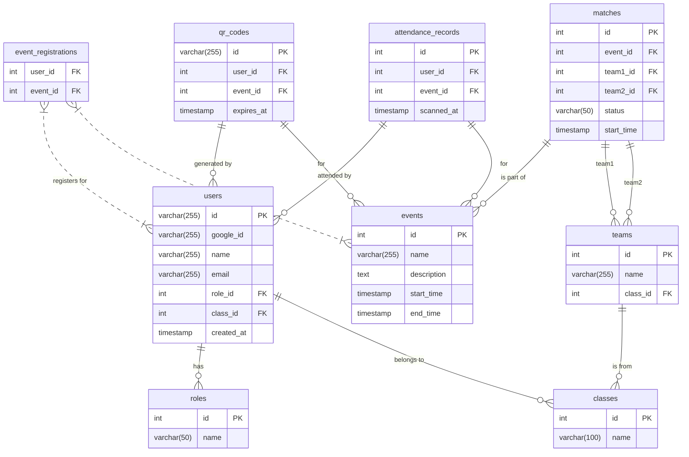

# Data Model: SportEase

**Source**: `spec.md` Key Entities
**Database**: PostgreSQL

This document defines the database schema for the SportEase project. Each microservice will manage a subset of these tables.

---

### E-R Diagram (Conceptual)

---

## Table Schemas

### `roles`
Stores user roles (e.g., 管理者, 学生).
- **Managed by**: User Service

| Column | Type | Constraints |
|---|---|---|
| `id` | `SERIAL` | **PRIMARY KEY** |
| `name` | `VARCHAR(50)` | **UNIQUE**, **NOT NULL** |

### `classes`
Stores student classes.
- **Managed by**: User Service

| Column | Type | Constraints |
|---|---|---|
| `id` | `SERIAL` | **PRIMARY KEY** |
| `name` | `VARCHAR(100)` | **UNIQUE**, **NOT NULL** |

### `users`
Core system users.
- **Managed by**: User Service

| Column | Type | Constraints |
|---|---|---|
| `id` | `UUID` | **PRIMARY KEY**, `DEFAULT gen_random_uuid()` |
| `google_id` | `VARCHAR(255)` | **UNIQUE**, **NOT NULL** |
| `name` | `VARCHAR(255)` | **NOT NULL** |
| `email` | `VARCHAR(255)` | **UNIQUE**, **NOT NULL** |
| `role_id` | `INTEGER` | **FOREIGN KEY** -> `roles(id)` |
| `class_id` | `INTEGER` | **FOREIGN KEY** -> `classes(id)`, NULLABLE |
| `created_at` | `TIMESTAMPTZ` | `DEFAULT NOW()` |
| `updated_at` | `TIMESTAMPTZ` | `DEFAULT NOW()` |

### `events`
Sports events.
- **Managed by**: Event Service

| Column | Type | Constraints |
|---|---|---|
| `id` | `SERIAL` | **PRIMARY KEY** |
| `name` | `VARCHAR(255)` | **NOT NULL** |
| `description` | `TEXT` | |
| `start_time` | `TIMESTAMPTZ` | **NOT NULL** |
| `end_time` | `TIMESTAMPTZ` | **NOT NULL** |

### `teams`
Teams participating in events, usually linked to a class.
- **Managed by**: Event Service

| Column | Type | Constraints |
|---|---|---|
| `id` | `SERIAL` | **PRIMARY KEY** |
| `name` | `VARCHAR(255)` | **NOT NULL** |
| `class_id` | `INTEGER` | **FOREIGN KEY** -> `classes(id)` |

### `matches`
Individual matches within an event.
- **Managed by**: Event Service

| Column | Type | Constraints |
|---|---|---|
| `id` | `SERIAL` | **PRIMARY KEY** |
| `event_id` | `INTEGER` | **FOREIGN KEY** -> `events(id)` |
| `round` | `INTEGER` | **NOT NULL** |
| `match_number_in_round` | `INTEGER` | **NOT NULL** |
| `team1_id` | `INTEGER` | **FOREIGN KEY** -> `teams(id)`, NULLABLE |
| `team2_id` | `INTEGER` | **FOREIGN KEY** -> `teams(id)`, NULLABLE |
| `winner_id` | `INTEGER` | **FOREIGN KEY** -> `teams(id)`, NULLABLE |
| `status` | `VARCHAR(50)` | `DEFAULT 'PENDING'` |
| `start_time` | `TIMESTAMPTZ` | NULLABLE |

### `event_registrations`
Join table for users registering for events.
- **Managed by**: Event Service

| Column | Type | Constraints |
|---|---|---|
| `user_id` | `UUID` | **PRIMARY KEY**, **FOREIGN KEY** -> `users(id)` |
| `event_id` | `INTEGER` | **PRIMARY KEY**, **FOREIGN KEY** -> `events(id)` |

### `qr_codes`
Stores temporary QR codes for event attendance.
- **Managed by**: QR Code Service

| Column | Type | Constraints |
|---|---|---|
| `id` | `UUID` | **PRIMARY KEY**, `DEFAULT gen_random_uuid()` |
| `user_id` | `UUID` | **FOREIGN KEY** -> `users(id)` |
| `event_id` | `INTEGER` | **FOREIGN KEY** -> `events(id)` |
| `expires_at` | `TIMESTAMPTZ` | **NOT NULL** |
| `created_at` | `TIMESTAMPTZ` | `DEFAULT NOW()` |

### `attendance_records`
Logs student attendance for events.
- **Managed by**: Attendance Service

| Column | Type | Constraints |
|---|---|---|
| `id` | `SERIAL` | **PRIMARY KEY** |
| `user_id` | `UUID` | **FOREIGN KEY** -> `users(id)` |
| `event_id` | `INTEGER` | **FOREIGN KEY** -> `events(id)` |
| `scanned_at` | `TIMESTAMPTZ` | `DEFAULT NOW()` |
